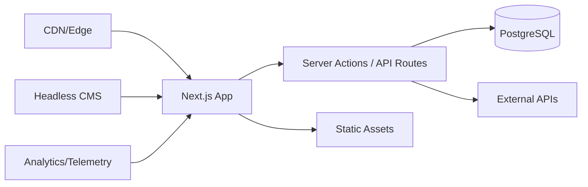

# Aureo Labs Website

> Where AI innovation meets enterprise reality.

   

Aureo Labs’ public website is a Next.js 14+ application that showcases our AI platforms, provides developer resources, and generates qualified demand—all with enterprise‑grade performance, accessibility, and security. This repo implements the specs in `/docs/spec.md` (Software Specification v1.1).

---

## Table of Contents

* [Overview](#overview)
* [Tech Stack](#tech-stack)
* [Getting Started](#getting-started)
* [Environment Variables](#environment-variables)
* [Scripts](#scripts)
* [Project Structure](#project-structure)
* [Design System](#design-system)
* [Content & CMS](#content--cms)
* [Analytics & Privacy](#analytics--privacy)
* [Performance](#performance)
* [Accessibility](#accessibility)
* [SEO](#seo)
* [Internationalization](#internationalization)
* [Security & Compliance](#security--compliance)
* [Testing & QA](#testing--qa)
* [CI/CD & Deployment](#cicd--deployment)
* [Release & Versioning](#release--versioning)
* [Contributing](#contributing)
* [Code of Conduct](#code-of-conduct)
* [License](#license)
* [Contact](#contact)

---

## Overview

* **Framework:** Next.js App Router, React Server Components, Edge‑ready
* **Goals:** interactive product demos, developer portal, thought leadership, and lead gen
* **Budgets:** ≤ 200 KB JS, ≤ 100 KB CSS per route (compressed)
* **Targets:** LCP ≤ 2.5s, INP ≤ 200ms, CLS ≤ 0.1 (p75)



---

## Tech Stack

* **Core:** Next.js 14+, TypeScript 5, React 18 (RSC)
* **UI:** Tailwind CSS, Radix UI, shadcn/ui, Framer Motion
* **Data:** PostgreSQL (Neon/Supabase), Redis (cache)
* **CMS:** Sanity.io (preferred) or Payload CMS
* **Search:** Algolia (or Typesense)
* **Payments:** Stripe (optional)
* **Observability:** Sentry, OpenTelemetry
* **Analytics:** Vercel Analytics, PostHog, LogRocket
* **Testing:** Vitest, Playwright, Storybook
* **Tooling:** Turborepo (optional), ESLint, Prettier

---

## Getting Started

### Prerequisites

* Node.js **≥ 20** (use `.nvmrc` for exact version)
* pnpm **≥ 9** (required package manager)
* Git **≥ 2.25**
* Vercel CLI (optional, for deployments)
* Sanity CLI (optional, if using Sanity CMS)

### Quick Setup

```bash
# 1) Clone repository
git clone https://github.com/aureolabs/website.git && cd website

# 2) Use correct Node version (if using nvm)
nvm use

# 3) Install dependencies
pnpm install

# 4) Configure environment
cp .env.example .env.local
# Edit .env.local with your values (see Environment Variables section)

# 5) Initialize Git hooks (for code quality)
pnpm prepare

# 6) Start development server
pnpm dev
# Open http://localhost:3000
```

### Development Workflow

```bash
# Start dev server with hot reload
pnpm dev

# Run type checking
pnpm typecheck

# Run linting
pnpm lint

# Format code
pnpm format

# Run unit tests
pnpm test

# Run E2E tests
pnpm test:e2e

# Build for production
pnpm build

# Start production server locally
pnpm start

# Analyze bundle size
pnpm analyze
```

### VS Code Setup

1. Install recommended extensions:
   ```bash
   code --install-extension dbaeumer.vscode-eslint
   code --install-extension esbenp.prettier-vscode
   code --install-extension bradlc.vscode-tailwindcss
   ```

2. Workspace settings are pre-configured in `.vscode/settings.json`

3. Use debug configurations in `.vscode/launch.json` for debugging

---

## Environment Variables

| Variable               | Required | Scope         | Description                                |
| ---------------------- | -------- | ------------- | ------------------------------------------ |
| `NEXT_PUBLIC_SITE_URL` | ✅        | client        | Canonical site URL                         |
| `NEXT_PUBLIC_ENV`      | ✅        | client        | `development` \| `staging` \| `production` |
| `DATABASE_URL`         | ✅        | server        | Postgres connection string                 |
| `REDIS_URL`            | ❖        | server        | Redis cache URL                            |
| `SANITY_PROJECT_ID`    | ❖        | server        | Sanity project ID                          |
| `SANITY_DATASET`       | ❖        | server        | Sanity dataset (e.g., `production`)        |
| `SANITY_READ_TOKEN`    | ❖        | server        | Token for preview/secure reads             |
| `ALGOLIA_APP_ID`       | ❖        | server        | Algolia application ID                     |
| `ALGOLIA_SEARCH_KEY`   | ❖        | client        | Public search key                          |
| `ALGOLIA_ADMIN_KEY`    | ❖        | server        | Admin key for indexing                     |
| `POSTHOG_KEY`          | ✅        | client        | PostHog project key                        |
| `SENTRY_DSN`           | ❖        | client+server | Sentry DSN for error reporting             |
| `STRIPE_PUBLIC_KEY`    | ❖        | client        | Stripe public key (if payments)            |
| `STRIPE_SECRET_KEY`    | ❖        | server        | Stripe secret key                          |

> `✅` required in all environments. `❖` required if the optional integration is enabled.

---

## Scripts

```jsonc
{
  "dev": "next dev",
  "build": "next build",
  "start": "next start",
  "lint": "eslint .",
  "typecheck": "tsc --noEmit",
  "test": "vitest",
  "test:e2e": "playwright test",
  "storybook": "storybook dev -p 6006",
  "storybook:build": "storybook build",
  "analyze": "ANALYZE=true next build",
  "format": "prettier --write .",
  "ci": "pnpm typecheck && pnpm lint && pnpm build && pnpm test"
}
```

---

## Project Structure

```
.
├─ .github/
│  └─ workflows/           # CI/CD pipelines
├─ .vscode/                # VS Code settings & debug configs
├─ src/
│  ├─ app/                 # App Router routes, layouts, metadata
│  ├─ components/          # UI components (shadcn/ui + custom)
│  ├─ lib/                 # Utilities (fetchers, analytics, auth)
│  ├─ hooks/               # Custom React hooks
│  ├─ utils/               # Helper functions
│  ├─ types/               # TypeScript type definitions
│  ├─ config/              # App configuration
│  ├─ styles/              # Global styles & design tokens
│  └─ test/                # Test setup & utilities
├─ content/                # MDX content (blog, case studies)
├─ public/                 # Static assets
├─ tests/
│  ├─ unit/                # Unit tests
│  └─ e2e/                 # E2E tests
├─ docs/                   # Project documentation
├─ .env.example            # Environment variables template
├─ next.config.mjs         # Next.js configuration
├─ tailwind.config.ts      # Tailwind CSS configuration
├─ tsconfig.json           # TypeScript configuration
├─ vitest.config.ts        # Vitest test configuration
├─ playwright.config.ts    # Playwright E2E configuration
└─ package.json            # Dependencies & scripts
```

---

## Design System

* **Tokens:** colors, typography, spacing, radii, shadows in `styles/tokens.css`
* **Components:** generated via shadcn/ui; accessible by default (Radix primitives)
* **Motion:** Framer Motion with `prefers-reduced-motion` handling
* **Dark Mode:** `class` strategy; themed via CSS variables

---

## Content & CMS

* **Sanity** recommended for headless content with:

  * Live preview (`/api/preview`)
  * Versioning & scheduling
  * Localized content (en-US, es-MX, pt-BR)
* **MDX** supported for long‑form content and tutorials

### Running Sanity (optional)

```bash
cd sanity && pnpm install
pnpm sanity dev
```

---

## Analytics & Privacy

* **Product analytics:** PostHog (events, funnels, experiments)
* **Web vitals:** Vercel Analytics
* **Errors & performance:** Sentry
* **Session replay:** LogRocket (opt‑in)
* **Consent:** IAB TCF 2.2‑compatible cookie banner; analytics only after consent

> We pseudonymize event data and respect DNT where legally required.

---

## Performance

* **Budgets:** JS ≤ 200 KB, CSS ≤ 100 KB, initial images ≤ 300 KB
* **Targets:** LCP ≤ 2.5s, INP ≤ 200ms, CLS ≤ 0.1
* **Tactics:** image optimization (AVIF/WebP), route‑level code‑splitting, Edge caching, ISR

### Local checks

```bash
# Lighthouse (Chrome)
npx @lhci/cli autorun
```

---

## Accessibility

* WCAG 2.2 AA baseline
* Keyboard navigation, visible focus, color‑contrast tested
* Motion reduced for `prefers-reduced-motion`

### Local checks

```bash
# Axe via Storybook addon or Playwright axe
pnpm test:e2e
```

---

## SEO

* Auto metadata via `generateMetadata`
* `next-sitemap` for sitemaps/robots
* JSON‑LD for Organization, Product, Article, Video
* Open Graph & Twitter cards with dynamic social images

---

## Internationalization

* Locale routing with Next.js (`en`, `es`, `pt`)
* Translations via JSON resources; date/number formatting per locale
* RTL‑ready foundations

---

## Security & Compliance

* **Auth (admin surfaces):** OAuth 2.0 + MFA (WebAuthn/TOTP)
* **Headers:** strict CSP (nonces), HSTS, COOP/COEP/CORP, Permissions‑Policy
* **Transport:** TLS 1.3 end‑to‑end
* **Data:** AES‑256 at rest (managed), retention & deletion SLAs
* **Compliance:** GDPR, LGPD, CCPA/CPRA; SOC 2 / ISO 27001 via providers
* **Disclosure:** `/.well-known/security.txt`; see SECURITY.md

---

## Testing & QA

* **Unit:** Vitest (≥ 80% coverage target)
* **E2E:** Playwright (critical user journeys)
* **Visual:** Storybook snapshots or Chromatic
* **Performance & A11y:** Lighthouse CI, axe

PRs must pass: typecheck, lint, tests, bundle size check, a11y checks.

---

## CI/CD & Deployment

* Hosted on **Vercel** (Edge + Functions)
* **Preview Deployments** per PR
* **Gradual rollouts** and instant rollbacks
* Environments: `dev`, `staging`, `production`

Deploy locally:

```bash
vercel link
vercel env pull .env.local
vercel --prod
```

---

## Release & Versioning

* **Commits:** Conventional Commits
* **Releases:** automated changelog via Release Please (optional)
* **Versioning:** SemVer; feature flags via Vercel Edge Config

---

## Contributing

1. Create a feature branch from `main` using the naming `feat/<scope>-<short-desc>`
2. Follow coding standards (ESLint/Prettier, TS strict)
3. Add tests for new behavior
4. Update docs if needed
5. Open a PR with a concise summary and screenshots

### PR Checklist

* [ ] Types pass & lints clean
* [ ] Tests added/updated and passing
* [ ] A11y checked (keyboard, contrast)
* [ ] Bundle impact acceptable
* [ ] Docs updated

---

## Code of Conduct

We aim for a helpful, inclusive community. By participating, you agree to uphold our Code of Conduct (see `CODE_OF_CONDUCT.md`).

---

## License

TBD. © Innovaciones MADFAM S.A.S. de C.V. All rights reserved.

---

## Contact

* **Security:** [security@aureolabs.dev](mailto:security@aureolabs.dev)
* **Partnerships:** [partnerships@aureolabs.dev](mailto:partnerships@aureolabs.dev)
* **General:** [hello@aureolabs.dev](mailto:hello@aureolabs.dev)

> Prefer English. Spanish (es‑MX) support available for client communications.
