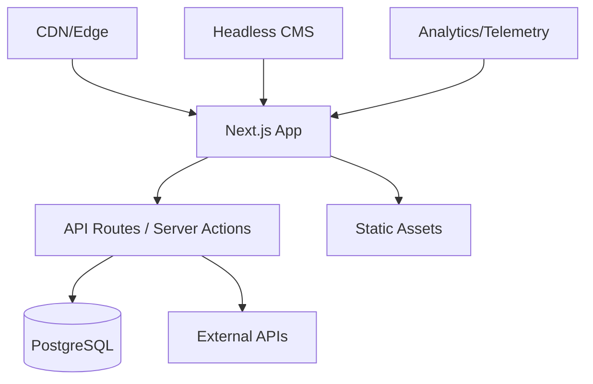

# SOFTWARE SPECIFICATION: AUREO LABS WEBSITE

**Document Version:** 1.1.0
**Last Updated:** 2 Sep 2025
**Status:** Ready for Implementation
**Owner:** Aureo Labs Product Team
**Approvals:** Pending

---

## Executive Summary

This specification defines the requirements for the standalone Aureo Labs website—a world‑class digital presence that positions Aureo Labs as a premier AI innovation laboratory while clearly linking to the MADFAM ecosystem.

**Vision:** Build an outstanding, engaging, and useful website that showcases Aureo Labs’ technological excellence and leadership in AI‑powered platforms.

**Mission:** Deliver an exceptional experience that converts visitors into customers, partners, and advocates through immersive product demonstrations, authoritative technical resources, and compelling storytelling.

---

## Table of Contents

1. [Project Overview](#project-overview)
2. [Brand Identity & Positioning](#brand-identity--positioning)
3. [Target Audiences](#target-audiences)
4. [Technical Architecture](#technical-architecture)
5. [User Experience Design](#user-experience-design)
6. [Content Strategy](#content-strategy)
7. [Product Showcase](#product-showcase)
8. [Features & Functionality](#features--functionality)
9. [Performance Requirements](#performance-requirements)
10. [Security, Privacy & Compliance](#security-privacy--compliance)
11. [Responsible AI](#responsible-ai)
12. [Analytics, SEO & Experimentation](#analytics-seo--experimentation)
13. [Governance & QA](#governance--qa)
14. [Development Roadmap](#development-roadmap)
15. [Assumptions, Risks & Non‑Goals](#assumptions-risks--non-goals)
16. [Success Criteria](#success-criteria)
17. [Appendices](#appendices)

---

## Project Overview

### Objectives

* Establish Aureo Labs as an independent innovation powerhouse connected to MADFAM
* Showcase the product portfolio with interactive, no‑friction demonstrations
* Provide world‑class developer resources and documentation
* Generate qualified leads and partner opportunities
* Build thought leadership in AI and automation for enterprise realities

### Success Metrics (12‑month targets)

* **Qualified leads:** +50% vs. current baseline
* **Global page load:** < 3s at p95 (cold) on LTE
* **Lighthouse (Perf/SEO/Best Practices/Accessibility):** ≥ 90/95/95/95
* **Demo conversion (landing → demo start):** ≥ 30%
* **Developer signups:** 10,000+ MAUs across portals and SDKs
* **Content engagement:** ≥ 60% average scroll depth on key assets

---

## Brand Identity & Positioning

### Visual Identity

```yaml
Palette:
  Primary:
    Amber: "#F59E0B"
    Copper: "#B45309"
    Gold: "#FCD34D"
  Accent:
    ElectricBlue: "#3B82F6"   # CTAs & interactive states
  NeutralScale:
    - "#111827"  # Gray-900
    - "#1F2937"
    - "#374151"
    - "#6B7280"
    - "#9CA3AF"
    - "#D1D5DB"
    - "#E5E7EB"
    - "#F3F4F6"
    - "#F9FAFB"
Typography:
  Display: "Inter Variable"  # fallback: "SF Pro Display"
  Body: System stack (ui-sans-serif)
  Code: "Fira Code" (ligatures on)
DesignLanguage:
  - Amber→Orange gradient overlays
  - Subtle glassmorphism for cards (with accessibility-checked contrast)
  - 60fps micro-interactions & motion
  - Fully themed dark mode
  - High-density data UI patterns
Iconography:
  - Lucide/Radix primitives, thin-weight
  - Consistent 24px grid
```

### Brand Voice

* **Technical yet accessible:** Demystify complexity, avoid jargon walls
* **Innovative:** Credible future-forward POV grounded in real deployments
* **Trustworthy:** Enterprise-grade reliability and clarity on limits
* **Human:** Personable, concise, and helpful

### Positioning Statement

**“Aureo Labs: Where AI innovation meets enterprise reality.”**

---

## Target Audiences

### Primary Segments

1. **Enterprise Decision Makers** (CTOs, VPs Eng, Innovation Officers)

   * **Needs:** ROI proof, timelines, security assurances
   * **Content:** Case studies, whitepapers, ROI calculators
2. **Developers & Technical Teams** (Engineers, DevOps, Architects)

   * **Needs:** API docs, SDKs, integration guides
   * **Content:** Interactive docs, code samples, sandboxes
3. **Startup Founders** (CEOs, PMs, Tech co‑founders)

   * **Needs:** Rapid implementation, scalability, cost clarity
   * **Content:** Quickstarts, pricing calculator, startup program
4. **Analysts & Investors** (Research, VCs, tech media)

   * **Needs:** Market position, growth metrics, roadmap signals
   * **Content:** Press kit, investor deck, research summaries

### Secondary Audiences

* Academics & researchers, prospective talent, ecosystem partners, regulators

---

## Technical Architecture

### Technology Stack

```typescript
// Core Framework
- Next.js 14+ (App Router, Server Actions, Edge Runtime)
- TypeScript 5.x
- React 18 (RSC)

// Styling & Animation
- Tailwind CSS 3.x (CSS variables for theming)
- Framer Motion

// UI Components
- Radix UI (accessible primitives)
- shadcn/ui
- React Hook Form + Zod (schema validation)

// 3D & Visualization
- Three.js / React Three Fiber
- D3.js for complex viz
- Lottie for lightweight animations

// State & Data Fetching
- Zustand (client state)
- TanStack Query (server cache)

// Backend & Infra
- Vercel (Edge Functions, Edge Config, Image Optimization)
- PostgreSQL (Neon/Supabase)
- Redis (KV cache)
- Stripe (payments, if applicable)

// Tooling
- Turborepo (monorepo)
- ESLint + Prettier
- Vitest (unit) + Playwright (E2E)
- Storybook (UI documentation)

// Observability
- Sentry (errors & performance)
- OpenTelemetry (tracing) → vendor export as needed

// Analytics
- Vercel Analytics (web vitals)
- PostHog (product analytics & experiments)
- LogRocket (session replay)
```

### Architecture Patterns



### CMS & Content

* **Sanity.io** (preferred) or **Payload CMS** with:

  * Visual editing & preview
  * Versioning & scheduled publishing
  * Multilingual (en‑US, es‑MX, pt‑BR) with locale fallbacks
  * Asset optimization & CDN
  * SEO fields (title, description, canonical, OG, JSON‑LD)

---

## User Experience Design

### Information Architecture

```
Home
├─ Products
│  ├─ PENNY (AI Assistant)
│  ├─ Cotiza Studio (Quotations)
│  ├─ Forge Sight (Pricing Intelligence)
│  ├─ Dhanam (Financial Wellness)
│  ├─ AVALA (Training Platform)
│  └─ Factlas (Geographic Intelligence)
├─ Solutions
│  ├─ By Industry
│  ├─ By Use Case
│  └─ By Company Size
├─ Developers
│  ├─ Documentation
│  ├─ API Reference
│  ├─ SDKs & Tools
│  ├─ Sandbox
│  └─ Community
├─ Resources
│  ├─ Blog
│  ├─ Case Studies
│  ├─ Whitepapers
│  ├─ Webinars
│  └─ Newsletter
├─ Company
│  ├─ About
│  ├─ Team
│  ├─ Careers
│  ├─ News
│  └─ Contact
└─ Labs
   ├─ Research
   ├─ Experiments
   ├─ Open Source
   └─ Publications
```

### Key User Flows

* **Product Discovery:** Landing → Product Grid → Product → Live Demo → Contact Sales
* **Developer Onboarding:** Dev Hub → Choose Product → API Docs → Get API Key → First Call
* **Enterprise Evaluation:** Solutions → Industry → Case Study → ROI Calculator → Schedule Demo

### Responsive Design System

```scss
// Breakpoints
$mobile: 320px;   // Base
$tablet: 768px;   // iPad
$desktop: 1024px; // Laptop
$wide: 1440px;    // Desktop
$ultra: 1920px;   // Large

// Behaviors
Mobile: stack vertical, full-width actions
Tablet: 2‑column grid, touch-optimized targets
Desktop: multi-column, rich hover/focus states
Wide: max content width 1440px
Ultra: enhanced visuals (parallax/3D), opt‑in
```

* **Accessibility first:** WCAG 2.2 AA minimum, prefers‑reduced‑motion support, focus states, semantic landmarks
* **Localization:** date/number formats, RTL‑ready foundations, locale routing

---

## Content Strategy

### Content Types

1. **Product Pages**

   * Interactive hero (live preview)
   * Feature matrix & integrations
   * Pricing tiers
   * Testimonials & proof points
   * Getting‑started guide
2. **Technical Documentation**

   * OpenAPI 3.0 reference
   * SDKs (Python, JS/TS, Go; Ruby optional)
   * Webhooks & events
   * Auth, rate limits, error handling
3. **Thought Leadership**

   * Research notes & papers
   * Industry insights blog
   * Tutorials & videos
   * Podcasts & talks
4. **Sales Enablement**

   * ROI & TCO calculators
   * Security whitepapers
   * Implementation roadmaps
   * Partner directory & success metrics

### Content Management

```yaml
CMS: Sanity.io (preferred) or Payload
Features:
  - Visual editing & live preview
  - Versioning & audit history
  - Multilingual & localization workflows
  - Asset optimization & image pipelines
  - SEO/OG fields & JSON-LD
  - Scheduled publishing & embargoes
```

---

## Product Showcase

### Interactive Product Demonstrations

#### PENNY — AI Assistant Platform

```typescript
interface PennyShowcase {
  liveChat: EmbeddedWidget;
  features: {
    naturalLanguage: InteractiveDemo;
    automation: WorkflowBuilder;
    integrations: EcosystemMap;
  };
  metrics: RealTimeStats; // latency, resolution accuracy, cost est.
  pricing: Calculator;
}
```

#### Forge Sight — Pricing Intelligence

```typescript
interface ForgeSightShowcase {
  dashboard: LiveDashboard;
  features: {
    priceDiscovery: MarketMap;
    benchmarking: ComparisonTool;
    analytics: DataVisualization;
  };
  apiPlayground: SwaggerUI;
  caseStudies: VideoTestimonials;
}
```

### Product Comparison Matrix

| Feature          | PENNY | Forge Sight | Cotiza | Dhanam | AVALA | Factlas |
| ---------------- | :---: | :---------: | :----: | :----: | :---: | :-----: |
| AI‑Powered       |   ✓   |      ✓      |    ✓   |    ✓   |   ✓   |    ✓    |
| Enterprise Ready |   ✓   |      ✓      |    ✓   |    –   |   ✓   |    ✓    |
| API Access       |   ✓   |      ✓      |    ✓   |    ✓   |   ✓   |    ✓    |
| Free Tier        |   ✓   |      –      |    ✓   |    ✓   |   –   |    –    |
| SLA (target)     | 99.9% |    99.95%   |  99.9% |  99.9% | 99.9% |  99.9%  |

> *SLA targets refer to service availability of hosted components; see Trust Center for definitions & exclusions.*

---

## Features & Functionality

### Core Features

1. **AI‑Powered Site Assistant**

   * Embedded PENNY chatbot on every page
   * Contextual help based on current page & user role
   * Natural‑language search
   * Personalized recommendations
   * Privacy‑aware conversation history (opt‑in)

2. **Developer Portal**

```typescript
const DeveloperPortal = {
  documentation: {
    api: OpenAPISpec,
    guides: StepByStep,
    reference: Searchable,
  },
  sandbox: {
    host: 'sandbox.aureolabs.dev',
    testData: 'preloaded',
    rateLimit: '120 req/min per IP',
  },
  sdks: {
    languages: ['Python', 'TypeScript/JavaScript', 'Go', 'Ruby'],
    frameworks: ['React', 'Vue', 'Angular', 'Next.js'],
  },
  community: {
    forum: 'DiscourseIntegration',
    discord: 'discord.gg/aureolabs',
    github: 'github.com/aureolabs',
  }
}
```

3. **Interactive Demos**

   * Sandbox environments for each product
   * Guided tours & tooltips
   * Sample datasets
   * Export/share demo state
   * No signup for basic demo; gated features for advanced

4. **Personalization Engine**

   * Behavior tracking (privacy‑respecting)
   * Dynamic content & CTAs by journey stage
   * Saved preferences & multi‑session continuity

5. **Advanced Search**

   * Algolia instant search (or Typesense alternative)
   * NL queries, filters by product/content type/date
   * Suggestions, recent searches

### Innovation Features

1. **Virtual Lab Tours**

   * 3D visualization of process & roadmap
   * Beta feature previews; community voting
2. **AI‑Generated Content Aids**

   * Personalized demos by industry
   * Draft implementation plans & checklists
   * Code generation for integrations (guard‑railed)
3. **Real‑Time Collaboration**

   * Live co‑browse with sales
   * Multi‑user demo sessions
   * Instant support chat

---

## Performance Requirements

### Core Web Vitals Targets (p75)

```yaml
LCP:  ≤ 2.5s
INP:  ≤ 200ms   # replaces FID
CLS:  ≤ 0.1
TTI:  ≤ 3.5s
FCP:  ≤ 1.8s
SpeedIndex: ≤ 3.0s
```

### Performance Budgets (per route, gzip/BR compressed)

* **JavaScript:** ≤ 200 KB
* **CSS:** ≤ 100 KB
* **Images (initial viewport):** ≤ 300 KB
* **Third‑party:** ≤ 2 critical; lazy‑load non‑critical

### Optimization Strategies

```typescript
const performance = {
  images: {
    format: 'AVIF/WebP with fallbacks',
    lazy: true,
    responsive: true,
    cdn: 'Vercel Image Optimization or Cloudinary',
  },
  code: {
    splitting: 'route-based',
    treeshaking: true,
    minify: true,
    compression: 'Brotli',
  },
  caching: {
    static: '1 year (immutable)',
    api: 'fine-grained Cache-Control',
    cdn: 'Vercel Edge Network',
    database: 'Redis layer for hot paths',
  },
  rendering: {
    ssr: 'critical pages',
    ssg: 'marketing pages',
    isr: 'blog & docs',
    streaming: 'large pages',
  }
}
```

---

## Security, Privacy & Compliance

### Security Requirements

```yaml
Authentication:
  - OAuth 2.0 / JWT (short-lived access, refresh rotation)
  - MFA (TOTP/WebAuthn) for admin surfaces
  - Session & device management
  - Rate limiting & bot protection

Data Protection:
  - TLS 1.3; HSTS preloading
  - AES‑256 at rest (managed provider)
  - Pseudonymization for analytics
  - Data retention & deletion SLAs

Infrastructure:
  - WAF & DDoS mitigation
  - Security headers: CSP (nonces), COOP/COEP/CORP, Permissions‑Policy, Referrer‑Policy
  - Secrets management (Vault/Doppler/1Password)
  - Regular SAST/DAST & dependency scanning

Compliance:
  - GDPR (EU), LGPD (Brazil), CCPA/CPRA (California)
  - SOC 2 Type II, ISO 27001 (provider attestations ok)
  - HIPAA (for healthcare contexts) — opt‑in boundaries
  - Cookie consent (IAB TCF 2.2 compatible)
```

### Trust Center Page

* Certifications & attestations (with links)
* Real‑time uptime & historical incidents
* Security whitepaper & architecture overview
* Vulnerability disclosure policy & security.txt
* Privacy policy, Terms of service, Cookie policy

---

## Responsible AI

* **Model transparency:** Clearly disclose models/providers and usage boundaries
* **Human‑in‑the‑loop:** Escalation paths for critical decisions
* **Evaluation:** Publish eval methodology for accuracy, bias, safety
* **Data handling:** No training on customer inputs without explicit consent
* **Content controls:** Toxicity & PII filters in demos; red‑teaming cadence
* **AI disclaimers:** Clear UX affordances around limitations & costs

---

## Analytics, SEO & Experimentation

### Measurement Framework (types)

```typescript
interface Analytics {
  product: {
    demoCompletions: number;
    featureUsage: Map<string, number>;
    timeToValue: Duration;
    funnel: FunnelMetrics;
  };
  content: {
    pageViews: number;
    engagementTime: Duration;
    scrollDepth: Percentage;
    interactions: ClickMap;
  };
  conversion: {
    leadQuality: Score;
    attribution: Channel;
    journey: Path[];
    revenueImpact: Currency;
  };
  technical: {
    webVitals: WebVitals;
    errors: ErrorRate;
    apiUsage: RequestMetrics;
    availability: Uptime;
  };
}
```

### A/B & Multi‑Variant Testing

```yaml
Tools:
  - PostHog Experiments (primary)
  - Vercel Edge Config (flagging & targeting)
  - GrowthBook or Optimizely (optional enterprise)
Focus Areas:
  - Homepage hero & above‑the‑fold narrative
  - CTA copy, placement & color
  - Pricing page layouts
  - Demo flow friction removal
  - Recommendation widgets
Success Metrics:
  - Conversion rate uplift
  - Demo starts/completions
  - Engagement time & bounce
  - Lead quality (MQL→SQL rate)
```

### SEO & Discoverability

* Technical SEO: sitemaps, robots, canonical tags, hreflang
* Structured data (JSON‑LD): Organization, Product, Article, Video
* Open Graph/Twitter Cards with auto‑generated social images
* Clean, descriptive URLs; breadcrumb markup
* 404/410 handling; 301 strategy for legacy paths

---

## Governance & QA

### Working Principles

1. **Mobile‑first; progressive enhancement** (core UX works without JS)
2. **Performance budget enforced in CI** (bundle size checks)
3. **Accessibility as a gate** (axe-core and manual review)
4. **Docs as part of delivery** (READMEs, Storybook, architectural ADRs)

### Code Quality

```typescript
const quality = {
  testing: {
    unit: '≥ 80% coverage',
    integration: 'critical paths',
    e2e: 'user journeys',
    visual: 'Chromatic or Storybook snapshots',
  },
  code: {
    linting: 'ESLint strict',
    formatting: 'Prettier',
    types: 'TypeScript strict',
    commits: 'Conventional Commits',
  },
  review: {
    pr: 'required for main',
    security: 'automated scanning',
    performance: 'bundle analysis',
    accessibility: 'axe-core + manual',
  }
}
```

### Environments & Deployment

```yaml
Environments:
  Development: dev.aureolabs.dev
  Staging:    staging.aureolabs.dev
  Production: www.aureolabs.dev

CI/CD:
  - GitHub Actions (build/test/lint)
  - Preview deployments per PR (Vercel)
  - Gradual rollouts & instant rollbacks

Monitoring:
  - Vercel Analytics
  - Sentry & uptime probes
  - Performance alerts (web vitals)

SLOs (web app):
  - Availability: ≥ 99.95% monthly
  - Error rate: < 0.2% p95
  - p95 API latency (edge→origin): < 300ms
Incident Response:
  - On‑call rota & runbooks (RTO 30m, RPO 15m)
```

---

## Development Roadmap

### Phase 1 — Foundation (Weeks 1–4)

* [ ] Project setup & infrastructure
* [ ] Design system & tokens
* [ ] Core page templates & navigation
* [ ] CMS models & live preview
* [ ] Basic product pages

### Phase 2 — Product Showcase (Weeks 5–8)

* [ ] Interactive product demos (v1)
* [ ] API documentation portal
* [ ] Pricing calculators & comparison tools
* [ ] Customer testimonials & proof library

### Phase 3 — Advanced Features (Weeks 9–12)

* [ ] Site assistant (PENNY) integration
* [ ] Personalization engine (rules + early ML)
* [ ] Developer sandbox
* [ ] Advanced search
* [ ] Analytics plumbing & dashboards

### Phase 4 — Optimization (Weeks 13–16)

* [ ] Performance tuning to budgets
* [ ] SEO enhancements & schema
* [ ] Experimentation setup (flags & tests)
* [ ] Security hardening & privacy review
* [ ] Launch readiness (content freeze, runbooks)

### Phase 5 — Post‑Launch (Ongoing)

* [ ] Editorial calendar & content production
* [ ] Feature iterations & A/Bs
* [ ] Performance & reliability monitoring
* [ ] Conversion rate optimization
* [ ] Internationalization rollouts

---

## Assumptions, Risks & Non‑Goals

### Assumptions

* Access to MADFAM brand assets and SSO for shared systems
* Product teams provide up‑to‑date API specs & demo datasets
* Vercel or equivalent edge hosting available

### Risks & Mitigations

* **Outdated metrics/content** → Editorial SLAs & content ownership
* **Third‑party vendor lock‑in** → Abstraction layers & exit plans
* **Performance regressions** → CI budgets, automated Lighthouse checks
* **Privacy misconfiguration** → DPA reviews, privacy sandbox environments

### Non‑Goals (v1)

* Native mobile apps
* Complex customer billing portals (basic Stripe checkout only)
* Full community platform (beyond forum/Discord integrations)

---

## Success Criteria

### Launch Metrics

* ✓ Six product pages with interactive demos (v1)
* ✓ < 3s global p95 load on primary routes
* ✓ 100% uptime during launch week
* ✓ ≥ 1,000 developer signups in Month 1
* ✓ ≥ 50 qualified enterprise leads by end of Quarter 1

### Long‑Term Goals (12–18 months)

* Industry‑leading NPS (> 70)
* Top‑3 share of voice in AI platform category
* 10,000+ active developers
* \$10M+ influenced pipeline
* Recognized thought leadership (speaking, citations)

---

## Appendices

### A. Competitor & Comparator Set

* Anthropic — clean, technical focus
* OpenAI — product‑centric, interactive
* Vercel — developer‑first modern patterns
* Stripe — documentation excellence

### B. Preferred Vendors

* Vercel — hosting & deployment
* Sanity — headless CMS
* Algolia (or Typesense) — search
* Stripe — payments
* PostHog — product analytics

### C. Reference Materials

* Next.js, Tailwind CSS, Radix UI, Web Performance guidance, WCAG 2.2

### D. Contacts

* Technical Lead: \[TBD]
* Design Lead: \[TBD]
* Product Owner: \[TBD]
* Project Manager: \[TBD]

---

> **Change Log**
> v1.1.0 — Updated Core Web Vitals (INP replaces FID), strengthened security & privacy, added Responsible AI and Governance sections, clarified budgets, localization scope, and experiment tooling.
